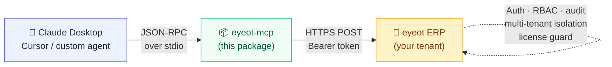

<div align="center">

# `eyeot-mcp`

### Plug Claude Desktop into your ERP.

**Official stdio ↔ HTTP bridge for the [eyeot ERP](https://erp.eyeot.fr) MCP server.**
~600 business tools, one `pip install`.

<br />

[](https://pypi.org/project/eyeot-mcp/)
[](https://pypi.org/project/eyeot-mcp/)
[](https://opensource.org/licenses/MIT)
[](https://modelcontextprotocol.io)

[](#)
[](#)
[](#)
[](#-authentication)

[**Landing page**](https://erp.eyeot.fr/mcp) · [**Docs**](https://erp.eyeot.fr/api/docs) · [**PyPI**](https://pypi.org/project/eyeot-mcp/) · [**Issues**](https://github.com/Termi24/ERP-by-Eyeot-Software/issues)

</div>

<br />

---

## ⚡ 60-second install

```bash
pip install eyeot-mcp        # 1.  install the bridge
eyeot-mcp login              # 2.  authenticate via browser (OAuth Device Flow)
```

Then paste into your Claude Desktop config:

```json
{
  "mcpServers": {
    "eyeot": {
      "command": "eyeot-mcp"
    }
  }
}
```

Restart Claude Desktop. Done. Ask: *"List my last 5 invoices."*

> **Config location**  ·  macOS `~/Library/Application Support/Claude/claude_desktop_config.json` · Windows `%APPDATA%\Claude\claude_desktop_config.json`

<br />

## 🧩 What is this?

The **eyeot ERP** exposes ~600 business actions — CRM, sales, stock, maintenance, HR, finance, IT service management, GED, RGPD compliance, plus 6 V2 marketplace modules (POS, delivery & routing, recruitment, BPM, field service, supply chain) — as **MCP tools over HTTPS**.

But Claude Desktop, Cursor, and most local agents only speak **MCP over stdio**.

`eyeot-mcp` is the missing piece between them.



**Zero business logic in the bridge.** Everything happens server-side — auth, RBAC, audit logging, license enforcement, multi-tenant isolation, idempotency. The CLI is ~290 lines of Python standard library. You can audit it in 10 minutes.

<br />

## 🎯 What can your agent do?

After install, your MCP client gets access to actions like:

| Domain | Try saying… |
|---|---|
| 💼 **CRM** | *"Create a quote for ACME — 10 units of PROD-001 at standard tariff."* |
| 📊 **Sales** | *"List my last 5 invoices and their payment status."* |
| 📦 **Stock** | *"Which products in Lyon site are below the critical threshold?"* |
| 🔧 **Maintenance** | *"Which equipment is overdue for preventive maintenance this week?"* |
| 👥 **HR** | *"Show me pending leave requests for my team."* |
| 💰 **Finance** | *"What's the revenue forecast for Q3 by business unit?"* |
| 🎫 **IT support** | *"Open a ticket: VPN is down for the marketing team, P1."* |
| 📄 **GED** | *"Find all signed NDAs for partner XYZ."* |
| 🧠 **Intelligence** | *"Customer-health distribution across all active accounts."* |
| 🧾 **POS / Caisse** | *"Today's Z-report total for the Lyon register."* |
| 🚚 **Delivery** | *"Optimize today's route for vehicle TL-204 and notify recipients."* |
| 🧑‍💼 **Recruitment** | *"Shortlist candidates for the senior developer posting."* |
| ⚙️ **Process / BPM** | *"Which approval tasks are pending in my inbox?"* |
| 🏗️ **Field service** | *"Schedule a site intervention for client XYZ next Tuesday."* |
| 🔩 **Supply chain** | *"Run MRP and list the components to reorder this week."* |

…and ~590 more, auto-generated from the [OpenAPI spec](https://erp.eyeot.fr/api/v1/openapi.json).

<br />

## 🔐 Authentication

Two modes, **same Bearer header** on the wire, **same Authorization decorator** server-side.

<table>
<tr>
<th width="50%">

### 🤖 OAuth 2.1 (humans)

</th>
<th width="50%">

### 🔑 API key (services)

</th>
</tr>
<tr>
<td valign="top">

For Claude Desktop, Cursor, personal agents.

```bash
eyeot-mcp login
```

Opens browser → approve → done. Credentials saved to `~/.eyeot-mcp/config.json` (mode `0600`).

- Token format: `eya_<base64>` access + `eyr_<base64>` refresh
- Lifetime: **1 h** access / **30 d** refresh
- **PKCE S256** mandatory (public clients)
- Refresh rotation with replay detection — a stolen refresh kills the whole token family
- The CLI **auto-refreshes** the access token (proactively before expiry + on a 401) — stay connected for the full 30-day refresh window without re-running `login`

</td>
<td valign="top">

For CI/CD agents, batch jobs, server-to-server.

```json
{
  "mcpServers": {
    "eyeot": {
      "command": "eyeot-mcp",
      "env": { "EYEOT_TOKEN": "eyk_xxx_xxx" }
    }
  }
}
```

Issued by an org admin from the eyeot ERP settings panel.

- Token format: `eyk_<prefix>_<secret>`
- Lifetime: **until revoked**
- Scope: org-wide, configurable RBAC

</td>
</tr>
</table>

<br />

## 🛡️ Security model

<table>
<tr>
<td width="25%" valign="top" align="center">

### 🔒
**OAuth 2.1 + PKCE**

Public clients use PKCE S256. Refresh rotation with replay detection.

</td>
<td width="25%" valign="top" align="center">

### 👮
**Server-side RBAC**

Every tool call goes through the same `@permissions_required` decorators as the UI.

</td>
<td width="25%" valign="top" align="center">

### 📝
**Full audit trail**

Every action logged with user + tenant + IP. RGPD-compliant retention.

</td>
<td width="25%" valign="top" align="center">

### 💳
**License grace**

Subscription lapsed? GETs still work so the agent can inform you. POSTs return 402 with `activate_url`.

</td>
</tr>
</table>

> **Local credentials** stored at `~/.eyeot-mcp/config.json` with file mode `0600` (POSIX). On Windows, file ACLs apply. **No telemetry, no phone-home.**

<br />

## 🏗️ Self-hosting

Point the bridge at any eyeot deployment with `--base-url`:

```bash
eyeot-mcp --base-url https://erp.example.com login
```

```json
{
  "mcpServers": {
    "eyeot": {
      "command": "eyeot-mcp",
      "args": ["--base-url", "https://erp.example.com"]
    }
  }
}
```

Same protocol, same auth, your infra.

<br />

## 📚 Commands

| Command | Description |
|---|---|
| `eyeot-mcp` | Start the stdio bridge using saved credentials (default mode — what Claude Desktop runs) |
| `eyeot-mcp login` | Browser-based OAuth Device Authorization Grant |
| `eyeot-mcp logout` | Revoke refresh token server-side, delete local credentials |
| `eyeot-mcp --token eyk_...` | One-shot mode with an explicit API key |
| `eyeot-mcp --base-url URL ...` | Target a self-hosted deployment |

<br />

## 🔧 How it works (under the hood)

1. Claude Desktop spawns `eyeot-mcp` as a child process, exchanges JSON-RPC 2.0 over its stdin/stdout pipes.
2. For each line received on stdin, the bridge `POST`s the JSON to `${base_url}/api/v1/mcp` with `Authorization: Bearer <token>`.
3. The HTTP response is written verbatim to stdout, framed as line-delimited JSON.
4. The server speaks MCP `2024-11-05` and auto-generates ~600 tools from the OpenAPI spec — `initialize`, `tools/list`, `tools/call` all work exactly as MCP clients expect.

No state in the bridge. No protocol translation beyond transport. No surprises.

<br />

## 📖 Resources

<table>
<tr>
<td valign="top">

#### Landing & install
- 🌐 [erp.eyeot.fr/mcp](https://erp.eyeot.fr/mcp)
- 📦 [PyPI](https://pypi.org/project/eyeot-mcp/)
- 🐙 [GitHub](https://github.com/Termi24/ERP-by-Eyeot-Software)

</td>
<td valign="top">

#### API
- 📘 [Swagger UI](https://erp.eyeot.fr/api/docs)
- 📄 [OpenAPI spec](https://erp.eyeot.fr/api/v1/openapi.json)
- 🧩 [MCP manifest](https://erp.eyeot.fr/api/v1/mcp/manifest)

</td>
<td valign="top">

#### Spec & protocol
- 🔗 [modelcontextprotocol.io](https://modelcontextprotocol.io)
- 🔐 [OAuth 2.1 (draft)](https://datatracker.ietf.org/doc/html/draft-ietf-oauth-v2-1)
- 📜 [RFC 8628 — Device Grant](https://datatracker.ietf.org/doc/html/rfc8628)

</td>
</tr>
</table>

<br />

## 🧭 Versioning

- This package: [Semantic Versioning](https://semver.org). Major bumps may change CLI flags or the on-disk config schema.
- MCP protocol: `2024-11-05` (negotiated server-side).
- ERP API: `/api/v1` (stable). Breaking changes ship as `/api/v2`.

<br />

## 📄 License

[**MIT**](LICENSE) — fork it, package it, audit it, build on top of it.

The eyeot ERP backend is a separate, proprietary product of **Eyeot Software**. This bridge is open-source so anyone can audit it, fork it, package it for their distro, or use it as a reference for building their own MCP clients.

<br />

---

<div align="center">

### ERP by Eyeot Software

Multi-tenant, AI-native ERP for SMBs. Built to be operated by AI agents from day one.

Every action you can do in the UI, you can do via this bridge.

🌐 [**erp.eyeot.fr**](https://erp.eyeot.fr)  ·  ✉️ [contact@eyeot.fr](mailto:contact@eyeot.fr)

</div>
